# KV Admission & Slot Management — Current Logic

> Codebase: `qllama-sm70` (llama.cpp fork), `tools/server/server-context.cpp`, `tools/server/server-task.cpp`
> Deployed on `caco-zero-three`: `--ctx-size 262144 --np 2 --kv-unified --kv-admission --cache-ram 12288 --cache-idle-slots (on)`

## 1. KV Admission

### 1.1 `kv_admission_needed(task)` (line 2720)

```
needed = sum over task + child_tasks of:
    n_tokens(task) + max_output
    where max_output = task.n_predict > 0 ? task.n_predict
                         : params.n_predict > 0 ? params.n_predict
                         : 8192
```

- `n_tokens(task)` = **full** prompt length (client sends the entire dialogue history each turn).
- Child tasks (parent/child orchestration) are summed separately.
- Worst-case estimate: assumes the full `max_output` will be generated.

### 1.2 `kv_admission_used()` (line 2740)

```
used = sum over ALL slots of: slot.prompt.n_tokens()
```

- Counts **every** slot (idle + processing). Idle slots pin their KV until explicitly cleared.
- With `--kv-unified`, all slots share one KV pool, so the sum reflects real pool occupancy.

### 1.3 Unified Admission Block (line 2780)

A **single** block, gated by `kv_admission && kv_unified`. Without both flags it is **skipped entirely** — the standard slot-selection path is used, no KV accounting, no idle clearing:

```cpp
if (kv_admission && kv_unified) {                    // line 2780
    needed = kv_admission_needed(task);

    if (needed > n_ctx)
        REJECT (400) — task can never fit, even in an empty pool

    used = kv_admission_used();                       // ALL slots (idle + processing)

    if (used + needed > n_ctx) {                       // pool under pressure
        used_if_cleared = sum over PROCESSING slots of slot.prompt.n_tokens();

        if (used_if_cleared + needed <= n_ctx) {       // clearing idle will actually help
            for each idle slot with tokens > 0:
                if (cache_idle_slots):
                    idle_slot.prompt_save(*prompt_cache)   // save FIRST (to RAM cache)
                idle_slot.prompt_clear()                   // then clear (mem.seq_rm + prompt.clear)
            prompt_cache->update()                          // evict if over RAM limits
            used = used_if_cleared;
        }

        if (used + needed > n_ctx)
            DEFER — queue the task, offer again later
    }
    // else: ADMIT — proceed to slot selection
}
```

**Why this is one decision, not two:**
- The pressure check (`used + needed > n_ctx`) happens **once**.
- If the pool is under pressure, the block **immediately** tries to make room (save+clear idle slots), then **re-checks the same condition** with the updated `used`.
- Two outcomes: room was made → ADMIT; room could not be made (no idle slots, or processing slots alone don't fit) → DEFER.

**Two guards inside the clear:**
1. **`used_if_cleared + needed <= n_ctx`** — clear idle slots only if the task will actually fit after the clear. If the task would be deferred anyway (pool full of processing slots), the clear is pure waste: it destroys KV + cache for no benefit.
2. **`prompt_save` before `prompt_clear`** — save the idle slot's KV to the RAM cache **before** destroying it. Without this, `prompt_clear()` calls `mem.seq_rm(id, -1, -1)` (removes KV from pool) + `prompt.clear()` (empties tokens), and the old context is **lost forever** — `prompt_save()` later would see `prompt.tokens.size() == 0` and return false.

**Standard behavior when flags are off:**
- `--kv-unified` off → the whole block is skipped; each slot owns its own budget, no shared pool, no cross-slot accounting, no idle clearing.
- `--kv-admission` off (unified on) → the block is skipped; tasks are admitted freely, overflow is handled by the upstream decode-fallback (`try_clear_idle_slots`, line 1989) — which clears **without** saving to the RAM cache.

## 2. Slot Selection — `get_available_slot(task)` (line 1865)

### 2.1 Phase 0: Explicit Slot (line 1871)

If `task.id_slot != -1`, use that slot directly (still goes through cache update logic below).

### 2.2 Phase 1: LCP Similarity (line 1879)

Only active if `slot_prompt_similarity != 0.0f` (default **0.0** — disabled).

Iterates all **idle** slots, computes:

```
lcp_len = slot.tokens.get_common_prefix(task.tokens)
f_sim   = lcp_len / task.tokens.size()
```

Selects the slot with the **highest** `f_sim` above the threshold `slot_prompt_similarity`.

If a slot is selected:
```
f_keep = (f_sim * task.tokens.size()) / slot.tokens.size()
if f_keep < 0.5:
    update_cache = true   // about to lose >50% of existing context
```

> **With default `slot_prompt_similarity = 0.0`, this phase is skipped entirely.** Slot selection falls through to LRU.

### 2.3 Phase 2: LRU Fallback (line 1933)

If no slot passed the similarity threshold (or similarity is disabled), selects the **least recently used** idle slot.

```
update_cache = true   // LRU slot is being repurposed
```

### 2.4 Cache Update (line 1956)

```
can_cache   = prompt_cache != null && task.type == COMPLETION
update_cache = can_cache && (update_cache || prompt_cache->has_better(slot.prompt, task.tokens))

if update_cache:
    slot.prompt_save(prompt_cache)        // serialize current KV to RAM cache
    if !slot.prompt_load(prompt_cache, task.tokens):
        slot.prompt_clear()              // fallback: clear if load failed
    prompt_cache->update()               // evict if over limits
```

## 3. `update_cache` Decision — The Full Picture

`update_cache` becomes `true` in **three** cases:

| # | Path | Condition | Line |
|---|------|-----------|------|
| 1 | **Similarity** | Slot selected by LCP similarity AND `f_keep < 0.5` (losing >50% of context) | 1926 |
| 2 | **LRU** | Slot selected by LRU (no similarity match, or similarity disabled) | 1952 |
| 3 | **has_better** | RAM cache holds a **better** starting point for this task than the slot's current state | 1962 |

All gated by `can_cache` (line 1958): only completion tasks, only if `prompt_cache` is enabled.

Final formula (line 1962):

```
update_cache = can_cache && (update_cache || prompt_cache->has_better(slot.prompt, task.tokens))
```

### What `update_cache = true` does (line 1964–1978)

```cpp
slot.prompt_save(prompt_cache);                    // 1. save CURRENT (old) KV to RAM cache
if (!slot.prompt_load(prompt_cache, task.tokens))  // 2. restore best cached context for NEW task
    slot.prompt_clear();                           //    if load failed — clear
prompt_cache->update();                            // 3. evict if over RAM limits
```

This is a **transition**: slot moves from conversation A to conversation B:
1. **Save A** → old context goes to RAM cache (so A can be restored later).
2. **Load B** → new task starts from a cached prefix, not from zero.

### How the admission fix breaks this (and how the new fix repairs it)

**Old (broken) flow:**
1. Admission clears idle slots **before** `get_available_slot`.
2. `prompt_clear()` removes KV from pool + empties tokens.
3. In `get_available_slot`: slot is empty → similarity skipped → LRU selected → `update_cache = true`.
4. `prompt_save`: `prompt.tokens.size() == 0` → **return false** — nothing saved.
5. `prompt_load`: finds nothing in RAM cache → `Cached = 0`.
6. Old context is **lost forever**.

**New (fixed) flow:**
1. Admission: pool under pressure → block **saves** each idle slot to RAM cache **before** clearing (only if the task will fit after the clear).
2. `prompt_clear()` removes KV from pool + empties tokens (old context is safe in RAM cache).
3. In `get_available_slot`: slot is empty → LRU selected → `update_cache = true`.
4. `prompt_save`: `prompt.tokens.size() == 0` → return false (nothing to save — already saved in step 1).
5. `prompt_load`: finds the saved entry in RAM cache → **restores KV** → `Cached > 0`.
6. Old context is preserved in RAM cache.

## 4. `prompt_save()` (line 302)

```
if prompt.tokens.size() == 0:
    return false                         // NOTHING to save
size = llama_state_seq_get_size_ext(ctx_tgt, id)
entry = prompt_cache.alloc(prompt, size_tgt, size_dft)
llama_state_seq_get_data_ext(ctx_tgt, entry.data, size, id)   // serialize KV
```

- Serializes the slot's **live** KV from `ctx_tgt` to a RAM cache entry.
- Returns `false` if `prompt.tokens` is empty (nothing to save) or if RAM cache is full.

## 5. `prompt_load()` → `prompt_cache.load()` (line 1876)

```
it_best = find_better(prompt, tokens_new)
if it_best != end:
    // restore KV into live context
    llama_state_seq_set_data_ext(ctx_tgt, it_best.data.main, id, 0)
    if it_best.data.drft: llama_state_seq_set_data_ext(ctx_dft, ...)
    // copy tokens + checkpoints (NOT KV bytes — they are now live in ctx)
    prompt.tokens = it_best->prompt.tokens.clone()
    prompt.checkpoints = it_best->prompt.checkpoints
return true   // always true, even if no match found
```

- Restores the cached KV into the live context **without consuming the cache entry**.
- The slot's `prompt.tokens` becomes the **cached prefix** (not the full task prompt).
- Prefill then computes `n_past = lcp(slot.prompt.tokens, task.tokens)` — the length of the restored prefix.

## 6. `find_better()` (line 1833) — **UPSTREAM CODE**

```
for each cached entry:
    lcp = entry.tokens.get_common_prefix(tokens_new)
    f_keep = lcp / entry.tokens.size()
    f_sim  = lcp / tokens_new.size()
    if f_keep < 0.25: continue          // don't trash large prompts
    if f_keep > f_keep_best AND f_sim > f_sim_best:
        it_best = entry
return it_best
```

- The `&&` condition is **strict**: a candidate must be better on **both** metrics simultaneously.
- The `f_keep < 0.25` guard skips entries where the match covers less than 25% of the cached prompt.
- This is **upstream** llama.cpp logic (commit `ba26708e1`), not a fork modification.

## 7. `prompt_cache.update()` (line 1935)

Second-chance eviction:
- While `size() > limit_size` or `n_tokens() > limit_tokens`:
  - Decay score of front entry, rotate to back.
  - Evict when `score <= 1`.
  - Hard iteration cap: `states.size() * 5`.
- `limit_size` = `--cache-ram` (12288 MiB in our config).
- `limit_tokens` = `--checkpoint-min-prompt` (dynamic, based on size-per-token).

## 8. Slot Lifecycle

### 8.1 `release()` (line 547)

```
if is_processing:
    state = SLOT_STATE_IDLE
    if task.is_child():
        prompt_clear()          // child slots: clear KV
    reset()
    callback_on_release(id)     // → queue_tasks.pop_deferred_task(id_slot)
```

- **Parent slots: KV is NOT cleared.** The slot stays idle with its KV pinned in the pool.
- **Child slots: KV IS cleared.**
- `callback_on_release` re-offers any deferred task that was waiting on this slot.

### 8.2 `reset()` (line 372)

Resets task pointer, stats, sampler, generated text. Does **not** touch KV or tokens.

### 8.3 `prompt_clear()` (line 337)

```
mem.seq_rm(id, -1, -1)    // remove ALL KV for this sequence from the pool
prompt.clear()            // empty the token list
```

### 8.4 Deferred Task Re-Offer

When a slot is released, `callback_on_release` calls `queue_tasks.pop_deferred_task(id_slot)`, which re-queues any task that was deferred waiting on this slot. The task goes through `process_single_task` again — admission check, slot selection, etc.

## 9. Prefill: How Much of the Restored KV Is Used

In `update_slots()` (line ~3740):

```
n_past = lcp(slot.prompt.tokens, task.tokens)   // length of restored prefix
pos_next = slot.prompt.tokens.pos_next(n_past)

// checkpoint restore can reduce n_past further
if n_past > 0:
    search for a context checkpoint that covers [0, n_past)
    if found: n_past = min(n_past, checkpoint.n_tokens)
    if not found: n_past = 0 (full re-prefill)

// chunk reuse can increase n_past
if can_cache_reuse && n_cache_reuse > 0:
    shift matching KV chunks from cache positions to new positions
    n_past += matched_chunks

// final: n_past tokens are "cached", the rest are prefilled
slot.stats.n_prompt_cached = n_past
slot.prompt.tokens.keep_first(n_past)
```

- `n_past` = number of tokens that are **restored from cache** (not re-prefilled).
- The dashboard's "Cached" column shows `n_past`.
- If `n_past = 0`, the entire prompt is re-prefilled (slow).

## 10. Mermaid Block Diagram

> **Важно:** admission — это **один** блок, гейтированный `kv_admission && kv_unified`.
> Без обоих флагов блок **полностью пропускается** — стандартная логика выбора слота.
> Внутри блока: проверка `needed > n_ctx` → REJECT; проверка `used + needed > n_ctx` →
> при давлении — освободить idle-слоты (save-then-clear), затем **повторная** проверка
> `used + needed > n_ctx` с уже обновлённым `used` → DEFER или ADMIT.

```mermaid
flowchart TD
    A[Task arrives<br/>process_single_task] --> G0

    subgraph ADMISSION["KV ADMISSION (single block, gate: kv_admission AND kv_unified)"]
        G0{kv_admission and kv_unified?}
        G0 -->|No: flags off| G1[skip admission<br/>standard slot selection]
        G0 -->|Yes| G2{needed > n_ctx?<br/>never fits, even empty pool}
        G2 -->|Yes| G3[REJECT 400]
        G2 -->|No| G4{used + needed > n_ctx?<br/>pool under pressure?}
        G4 -->|No| G10[ADMIT]
        G4 -->|Yes| G5[used_if_cleared =<br/>sum of PROCESSING slots only]
        G5 --> G6{used_if_cleared + needed <= n_ctx?<br/>clearing idle will help?}
        G6 -->|No| G7[SKIP clear<br/>idle KV + RAM cache untouched]
        G6 -->|Yes| G8[for each idle slot with tokens:<br/>1 prompt_save to RAM cache<br/>2 prompt_clear<br/>then prompt_cache.update]
        G7 --> G9
        G8 --> G9[used = used_if_cleared]
        G9 --> G11{used + needed > n_ctx?<br/>RE-CHECK after cleanup}
        G11 -->|Yes| G12[DEFER to queue]
        G11 -->|No| G10
    end

    G1 --> S0
    G10 --> S0

    subgraph SLOT["get_available_slot (no KV-budget check here)"]
        S0{task.id_slot != -1?}
        S0 -->|Yes| S1[select by id]
        S0 -->|No| S2{slot_prompt_similarity > 0?}
        S2 -->|Yes| S3[best LCP-similarity<br/>idle non-empty slot]
        S2 -->|No| S4
        S3 --> S5{found?}
        S5 -->|No| S4
        S5 -->|Yes| S8
        S4[LRU: least-recently-used idle slot]
        S8{slot found?}
        S8 -->|No| S9[return nullptr]
        S8 -->|Yes| S10[update_cache = can_cache AND<br/>update_cache OR has_better]
        S10 --> S11{update_cache?}
        S11 -->|Yes| S12[prompt_save old ctx to RAM<br/>prompt_load new ctx from RAM<br/>fail then prompt_clear<br/>prompt_cache.update]
        S11 -->|No| S13[no cache update]
        S12 --> S14[return slot]
        S13 --> S14
    end

    S9 --> D1[DEFER: no slot available]
    S14 --> D2{slot->is_processing?}
    D2 -->|Yes| D3[DEFER: requested slot busy]
    D2 -->|No| D4{task.is_parent?}
    D4 -->|Yes| D5[reserve child slots<br/>not enough then DEFER]
    D4 -->|No| D6[launch_slot_with_task]
    D5 --> D6

    D6 --> P[POST-LAUNCH PUBLICATION:<br/>for each idle slot, if cache_idle_slots:<br/>prompt_save to RAM cache + update]

    P --> R1[Prefill: n_past = lcp of restored prefix]
    R1 --> R2[Decode / Generation]
    R2 --> R3[release: state = IDLE,<br/>KV pinned in pool,<br/>re-offer deferred tasks]

    style G3 fill:#ff6b6b,stroke:#c0392b,color:#fff
    style G12 fill:#f39c12,stroke:#e67e22,color:#fff
    style G1 fill:#2ecc71,stroke:#27ae60,color:#fff
    style G10 fill:#2ecc71,stroke:#27ae60,color:#fff
    style G8 fill:#2ecc71,stroke:#27ae60,color:#fff
    style G7 fill:#95a5a6,stroke:#7f8c8d,color:#fff
    style D1 fill:#f39c12,stroke:#e67e22,color:#fff
    style D3 fill:#f39c12,stroke:#e67e22,color:#fff
    style S9 fill:#f39c12,stroke:#e67e22,color:#fff
    style P fill:#9b59b6,stroke:#8e44ad,color:#fff
```



## 11. Summary

| Component | File | Line | Status |
|-----------|------|------|--------|
| `kv_admission_needed` | server-context.cpp | 2720 | OK |
| `kv_admission_used` | server-context.cpp | 2740 | OK (all slots) |
| Unified admission block | server-context.cpp | 2780–2826 | **FIXED** (single gate: reject → pressure → save-then-clear → re-check → admit/defer) |
| `get_available_slot` | server-context.cpp | 1865 | OK |
| `prompt_save` | server-context.cpp | 302 | OK |
| `prompt_load` | server-context.cpp | 328 | OK |
| `find_better` | server-task.cpp | 1833 | Upstream, strict `&&` |
| `prompt_cache.update` | server-task.cpp | 1935 | OK |
| `release` | server-context.cpp | 547 | OK (parent KV pinned) |
| `prompt_clear` | server-context.cpp | 337 | OK (used after save) |
| Post-launch idle save | server-context.cpp | 2871 | OK |
| `try_clear_idle_slots` (decode-fallback) | server-context.cpp | 1989 | Upstream, clears WITHOUT save |
| Prefill `n_past` | server-context.cpp | ~3740 | OK |
| Deferred re-offer | server-context.cpp | 1619 | OK |

**Root cause of `Cached = 0`:** The admission fix cleared idle slots' KV **before** `prompt_save()` could serialize it to the RAM cache, breaking the caching pipeline.

**Fix:** Save each idle slot to the RAM cache **before** clearing it, and only clear if the task will actually fit after the clear (`used_if_cleared + needed <= n_ctx`). All of this lives inside **one** admission block gated by `kv_admission && kv_unified` — with the flags off, the standard slot-selection path is used unchanged.
